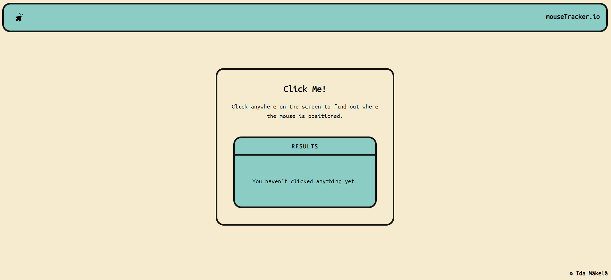

# React + TypeScript + Vite + Tailwind

## Assignment One: App One

I made a mouse tracking web application that display different results in the UI depending on where the user clicks, the application also have a custom cursor that changes styling after every click by using useEffect, useState and a timeout function. 

This assignment was part of the Web & App development course. 

## Preview

[Click here to view the live website.](https://mouse-tracker-sigma.vercel.app/)

## Grading

### G

- Written in TypeScript
- Utilizes the useState hook
- Utilizes the useEffect hook
- Uses one of Styled Components, Tailwind or Sass for styling
- Must have a responsive design

### VG

- Consistently organized files and naming conventions
- Practical application of useState and useEffect
- State is changed
- Each App uses a different approach to styling
- Shows an application of the features of the styling library (eg if Tailwind I would expect to see theme extension/ overrides and almost no CSS)

## Feedback from teacher

You are welcomed to write your feedback here Rob! :D 